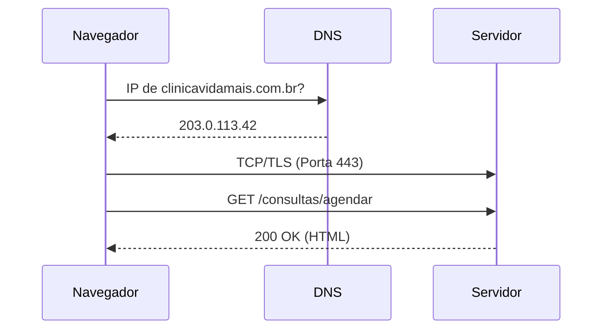

## O caminho de uma requisição

## Evidência do DNS

Server: 127.0.0.53
Address: 127.0.0.53#53

Non-authoritative answer:
Name: github.com
Address: 189.126.108.15

## Evidência do HTTP

| Método | Recurso | Código de Status | Tipo |
| :--- | :--- | :--- | :--- |
| GET | markdown.css | 200 | stylesheet |
| GET | katex.min.css | 200 | stylesheet |
| GET | index.js | 200 | script |
| GET | aaaba | 404 | document |
