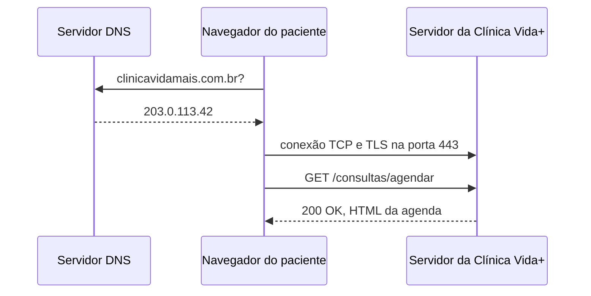

## O caminho de uma requisição

## Evidência do DNS

Server: 127.0.0.53
Address: 127.0.0.53#53

Non-authoritative answer:
Name: github.com
Address: 189.126.108.15

## Evidência do HTTP

| Método | Recurso | Código de Status | Tipo |
| :--- | :--- | :--- | :--- |
| GET | markdown.css | 200 | stylesheet |
| GET | katex.min.css | 200 | stylesheet |
| GET | index.js | 200 | script |
| GET | aaaba | 404 | document |

Existe a necessidade do HTTPS para garantia de maior segurança, os usuários poderão se cadastrar e colocar seus dados como CPF, dados bancários, cartões, telefone e etc. 
O sistema de segurança previne que isso não vaze para terceiros. Seguindo a Lei Geral de Proteção de Dados (LGPD) garante 
